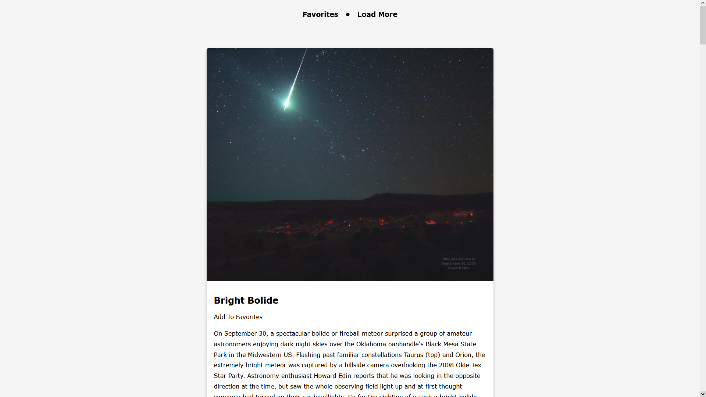

# <u>APOD - Astronomy Picture of the Day<u>

## About the project

Another project unsing an API. The objective was to display an image + some other piece of information from the nasa APOD API.The user is also able to save his favorite articles or delete them. This was achieved by using the localStorage object which allows the user to save key/value pairs in the browser.

For more information regarding the NASA API please visit [NASA APIs](https://api.nasa.gov/).

## For this project i used

## The project

